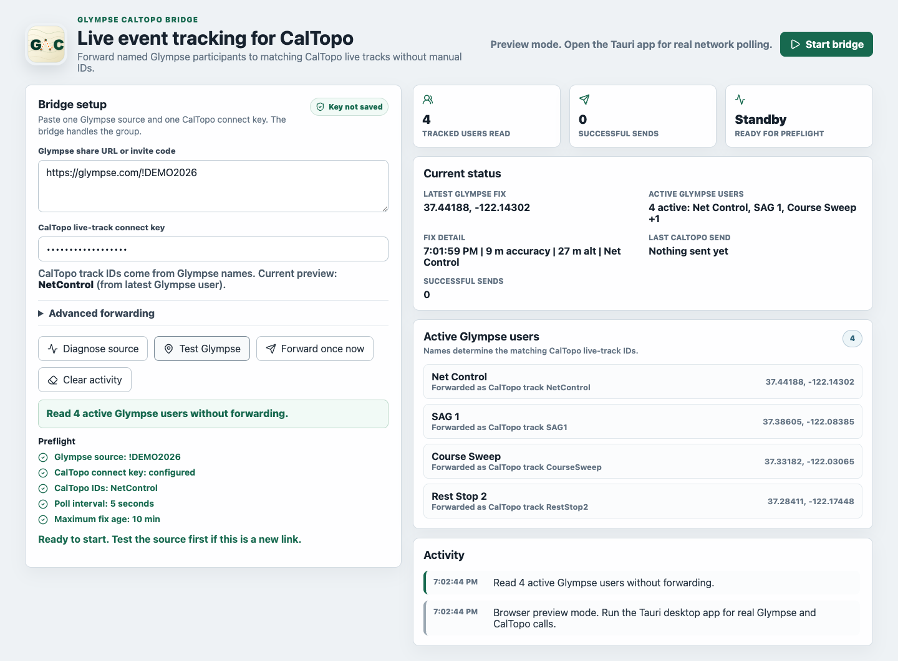
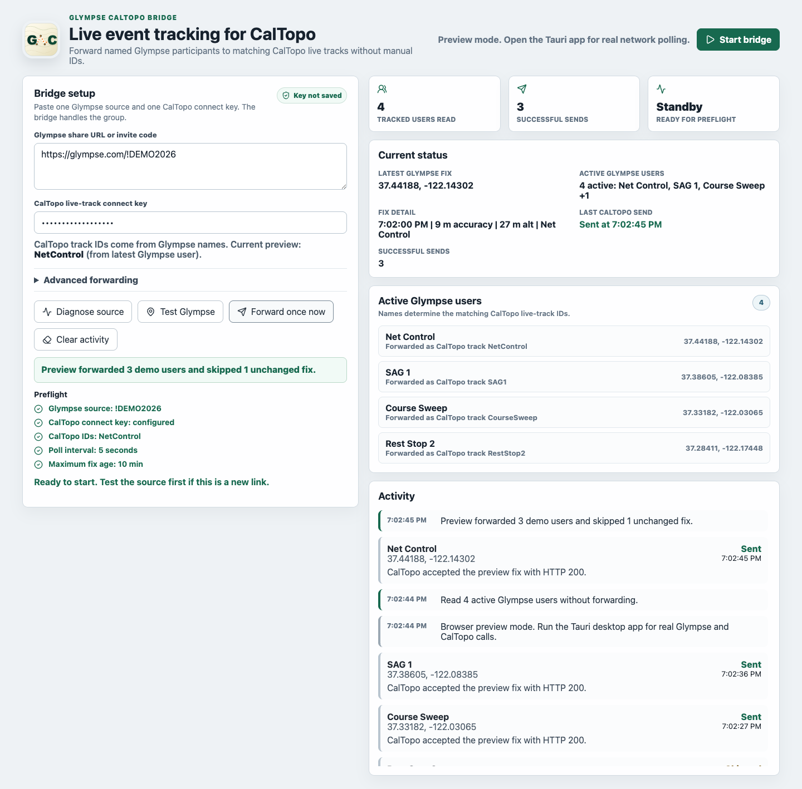
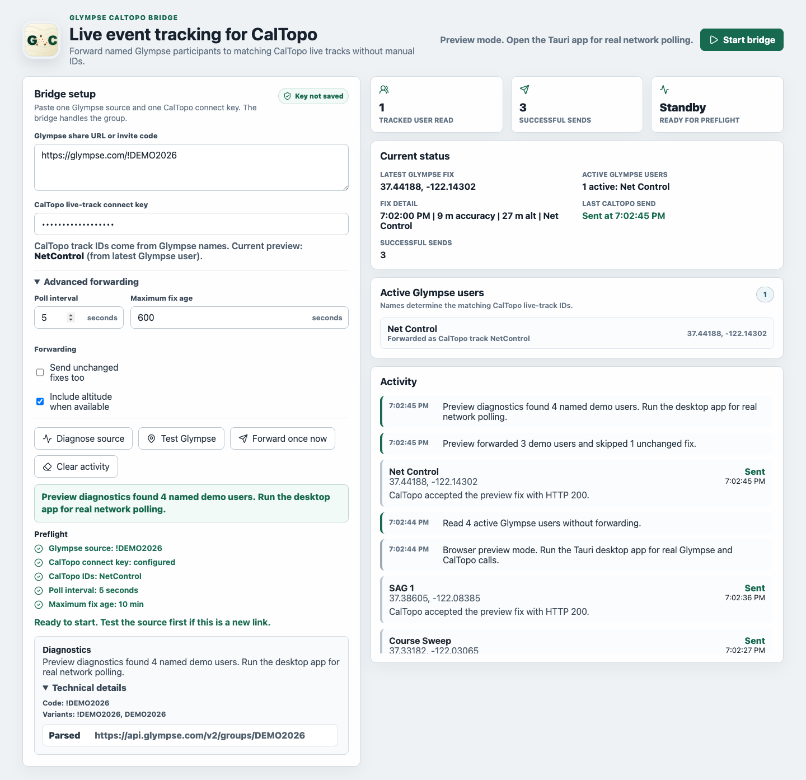
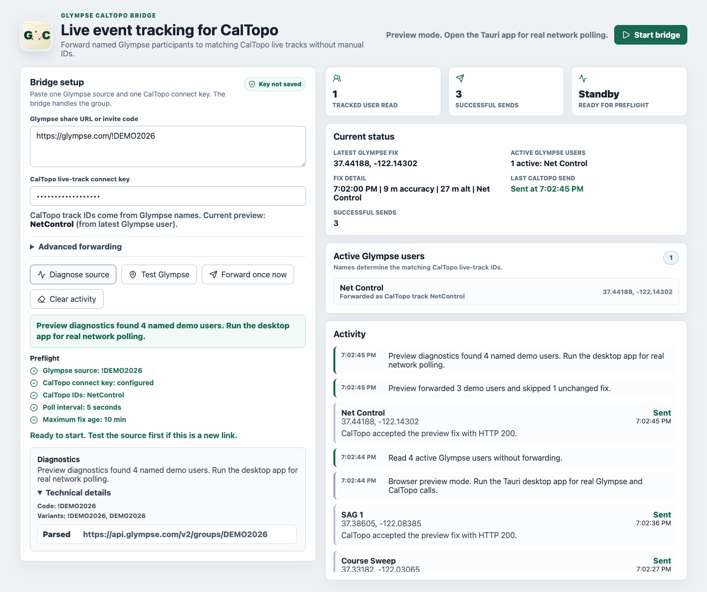
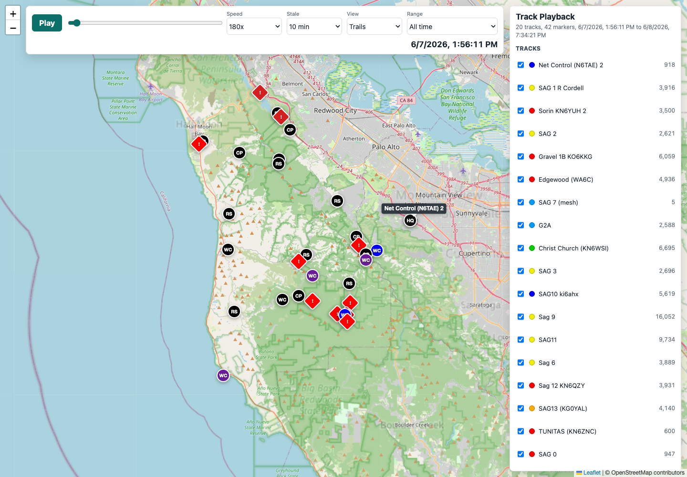

# Glympse CalTopo Bridge


Forward live Glympse group locations into CalTopo as separate live tracks.

Glympse CalTopo Bridge is a cross-platform desktop app for event teams that need one shared Glympse source reflected in CalTopo, with a distinct live track for every named participant.

[Download the latest release](https://github.com/RCGV1/Glympse-CalTopo-Bridge/releases/latest)



## Why Use It

- One Glympse group in, many CalTopo live tracks out.
- CalTopo track IDs are derived from Glympse display names, so operators do not manually assign every participant.
- Named fixes only: unnamed or generic parsed locations are not forwarded.
- Stale, missing-time, and future-dated fixes are rejected before CalTopo sends.
- Duplicate protection skips unchanged fixes by default.
- Diagnostics help explain expired links, unreadable sources, and parsing failures with redacted previews.
- Desktop bundles are published for macOS, Windows, Linux, and Raspberry Pi OS ARM64.

## Download

Use [Releases](https://github.com/RCGV1/Glympse-CalTopo-Bridge/releases/latest) for current builds. Asset names include the version number.

| Platform | Download |
| --- | --- |
| macOS Apple Silicon | `Glympse.CalTopo.Bridge_*_aarch64.dmg` |
| macOS Intel | `Glympse.CalTopo.Bridge_*_x64.dmg` |
| Windows installer | `Glympse.CalTopo.Bridge_*_x64-setup.exe` or `Glympse.CalTopo.Bridge_*_x64_en-US.msi` |
| Debian/Ubuntu Linux | `Glympse.CalTopo.Bridge_*_amd64.deb` |
| Linux AppImage | `Glympse.CalTopo.Bridge_*_amd64.AppImage` |
| Fedora/RHEL Linux | `Glympse.CalTopo.Bridge-*-1.x86_64.rpm` |
| Raspberry Pi OS 64-bit | `Glympse.CalTopo.Bridge_*_arm64.deb` |

For Raspberry Pi OS, the installer can fetch and install the latest ARM64 `.deb`:

```bash
curl -fsSL https://raw.githubusercontent.com/RCGV1/Glympse-CalTopo-Bridge/main/scripts/install-raspi.sh | bash
```

The project does not currently publish a 32-bit `armhf` Raspberry Pi OS package.

## Quick Start

1. Create or copy a CalTopo live-track connect key.
2. Create or copy an active Glympse share URL, invite code, or public `!tag`.
3. Open the app and paste both values into **Bridge setup**.
4. Click **Test Glympse** and confirm named users appear.
5. Click **Forward once now** and verify the tracks in CalTopo.
6. Click **Start bridge** to keep syncing.



## How It Works

The bridge sends CalTopo live reports shaped like:

```text
https://caltopo.com/api/v1/position/report/{CONNECT_KEY}?id={TRACK_ID}&lat={LAT}&lng={LNG}
```

Paste only the CalTopo connect key into the app. The key is masked in the UI and is not persisted in browser/local preview storage.

Supported Glympse source formats:

```text
https://glympse.com/!ABC123
!ABC123
ABC123
!PublicTag
```

For large groups, make sure each participant has a short, unique Glympse display name before the event starts.

## Track Names

CalTopo IDs are made from Glympse names by removing spaces, hyphens, and non-alphanumeric characters:

```text
Lead Vehicle -> LeadVehicle
Sweep Two    -> SweepTwo
Car-1        -> Car1
```

Short tactical names are normalized before forwarding:

```text
C 1             -> C1
B1              -> B1
S2 6504859116   -> S2
```

Names that normalize to the same value will map to the same CalTopo track. Avoid near-duplicates like `Car 1`, `Car-1`, and `Car_1` in the same group.

## Operating Safely

- Verify each expected participant in **Active Glympse users** before relying on the bridge.
- Run **Forward once now** and confirm tracks in CalTopo before unattended operation.
- Keep the host computer awake and online while the bridge is running.
- Use a longer poll interval for very large groups or slow networks.
- Keep connect keys private and rotate any key that was shared too broadly.
- Confirm CalTopo output before using tracks for operational decisions.

Advanced forwarding controls include poll interval, maximum fix age, duplicate-send behavior, and altitude forwarding.



## Diagnostics

Use **Diagnose source** when a Glympse link does not behave as expected. Diagnostics try the anonymous viewer flow, source variants, group member lookups, and redacted response previews.



## Troubleshooting

### Test Glympse Finds No Users

Make sure the Glympse share is active. Expired shares and empty public tags often return valid responses with no usable location. Click **Diagnose source** and inspect which attempted URL parsed, failed, or discovered group member lookups.

### A Participant Does Not Appear In CalTopo

Check **Active Glympse users**. If the participant is unnamed, the bridge intentionally does not forward that fix. Set a real Glympse display name and test again.

### Multiple People Collapse Into One CalTopo Track

Their names probably normalize to the same ID. Rename the Glympse users so the alphanumeric form is unique.

### CalTopo Rejects A Send

Verify the connect key is correct and still active. The app needs the connect key, not a full CalTopo report URL. The **Activity** panel shows the HTTP status and a short response summary when CalTopo rejects a request.

### A Fix Is Rejected As Stale

The bridge requires a current Glympse timestamp before forwarding. Increase **Maximum fix age** only if your event workflow intentionally tolerates older source positions.

## Track Playback Companion

The companion playback tool replays timestamped CalTopo track histories and event markers in a browser.

[Open the hosted playback tool](https://caltopo-track-playback.vercel.app/) or see [playback-tool/README.md](playback-tool/README.md).



## Development

Install Node.js and Rust, then run:

```bash
npm ci
npm run tauri:dev
```

Browser preview mode can render the UI with sanitized demo data. Real Glympse and CalTopo calls require the Tauri desktop app.

Run checks:

```bash
npm test
npm run build
```

Build a local desktop bundle:

```bash
npm run tauri:build
```

## Release

1. Keep `package.json`, `package-lock.json`, `src-tauri/Cargo.toml`, and `src-tauri/tauri.conf.json` on the same version.
2. Run `npm test` and `npm run build`.
3. Commit source changes.
4. Create and push a tag such as `v0.1.5`.
5. GitHub Actions publishes release bundles for macOS, Linux, Windows, and Raspberry Pi OS ARM64.

## Relationship To Services

This project is not affiliated with, endorsed by, or sponsored by Glympse or CalTopo.

## License

GPL-3.0-only. See [LICENSE](LICENSE).
